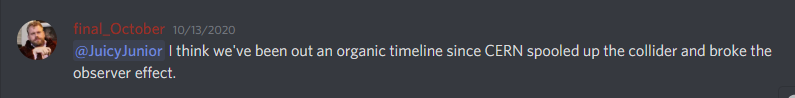
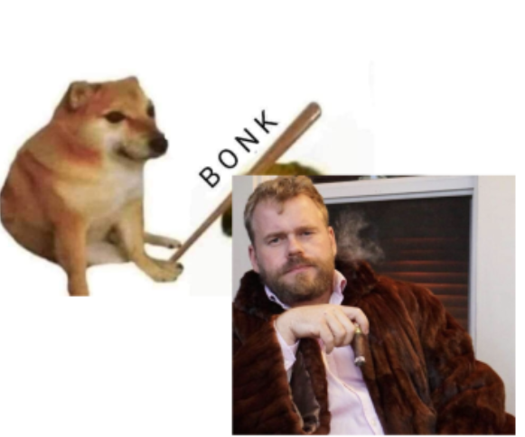

# Abandon all hope, all ye who enter here

From CS's sheet:

#### Posts Section.

THE PHRASE  
“I CAN HEAR THE BELLS OUT MY WINDOW”  
"THE SOUND OF A BELL"  
IS NOT THE SAME.  
AS THE SOUND OF A BELL.  
ALL WE BELIVE IS SIMPLY A SIGNPOST, TO ALL THAT IS.  
AND THOSE ARE NOT THE SAME.  
THE CORPORATION COOPERATES.

[https://www.reddit.com/r/thecorporation/comments/jmh11i/go\_to\_rfacepalm\_top\_post\_dont\_be_disruptive/gavgmsy/?context=3](https://www.reddit.com/r/thecorporation/comments/jmh11i/go_to_rfacepalm_top_post_dont_be_disruptive/gavgmsy/?context=3)

Accounts Associated:
_eternalSeptember_
_finalOctober_
november_Dawn	
namsilat

First post on r/thecorporation 9 years ago
Account currently being used
Future account?
Account who posted the GME DD -> possibly fO?

sub origin https://www.reddit.com/r/UnresolvedMysteries/comments/gyk8wn/8_years_ago_a_subreddit_was_created_by_user/?utm_source=share&utm_medium=ios_app&utm_name=iossmf

sub kind of origin https://www.reddit.com/r/ARG/comments/gyvghk/subreddit_with_just_1_post_that_consists_of_a/  <-- mentions nextse7en

Possible leads?

Telex - Outdated computing system predating texting? https://en.wikipedia.org/wiki/Telex
Feel free to add anything in these lines:
asking @Godsbutforthewisdom the right questions about what fO is
eternal september (think usenet) -> final october (fO IS the end of that cycle, a return to balance)

The story is about a rhinoceros in a village. But that concept is way down the line, we're only halfway in. https://en.wikipedia.org/wiki/Rhinoceros_(play)
Meaning behind subreddit thread titles

#### Discord Section.

https://www.youtube.com/user/nextse7en/featured
https://en.wikipedia.org/wiki/Rhinoceros_(play)
Enki - Wikipedia
http://pages.erau.edu/~andrewsa/NamShubandCode1.html
https://www.youtube.com/watch?v=fcPWU59Luoc&list=PLVJ4u_814FOE4yQlsyey7cJN6agPGeRAF&index=17&t=0s
https://www.corning.com/worldwide/en/about-us/news-events/news-releases/2020/05/corning-and-pfizer-announce-new-supply-agreement-for-corning-valor-glass-packaging.html
https://brooklynrail.org/2018/12/books/Daniel-Gumbiners-The-Boatbuilder
https://www.garyascott.com/2018/06/18/58865.html
Maslow's hierarchy of needs - Wikipedia
Bhagavan Das (yogi) - Wikipedia
https://en.wikipedia.org/wiki/The_Death_of_Expertise

[http://www.namsilat.com/](http://www.namsilat.com/) (possible website)

__02/11/202 summary by sol__

If fO is in a burning house and is trying to lead us out, we are also in a burning house but we don't know yet.
He mentioned earlier on that if we are already happy, then he has nothing to offer us. But he has gathered us all from WSB, which mostly likely means we are missing something in our lives which we seek money to remedy. But money will never remedy it, like how he describes he should be in all accounts a success story

People are being disconnected from one-another in modern society is important.
The evolution of humans from ancient times to modern times involves the transition from a state of mind where one was driven by schizo-like visions to one of planning and temporal-locality where time is marked by artefacts in our memory.
Something about this system is unable to be replicated / something about our current society leads us to obsession with AI, but fO believes we will never reach that goal
The emptiness created listening to the gong is important
Lots of allegories about how we feel, and why so many people feel the need go end it.

*whatever this is -kneecaps*

#### Possible Hints from Corp Sub

https://web.archive.org/web/20200608065030/https://nextse7en.com/
https://www.reddit.com/r/thecorporation/comments/jlp0hh/the_story_so_far/
https://www.reddit.com/r/thecorporation/comments/jihs3e/halsha_va_karvak/
It's smaller than a breadbox
Man Yells at Cloud
2 billion vials for ants
about eclipse which let to people deducing about corona (also related to 2 billion vials) I asked if it was part of the riddle he said yes

#### LATIN TREES

**MEMBERS AND ACCEPTED PASSPHRASES**

| MEMBERS         | PASSPHRASES                                 | LINKS                                                                                                                             |
|-----------------|---------------------------------------------|-----------------------------------------------------------------------------------------------------------------------------------|
| TheModestMax    | Sequoia semperviren 18                      | https://www.reddit.com/r/thecorporation/comments/hbs4e2/incursion_interrupted/fvas4el?utm_source=share&utm_medium=web2x&context=3 |
| 25-8-366        | Juniperus nana- 13                          | https://www.reddit.com/r/thecorporation/comments/hbs4e2/incursion_interrupted/fvavo4r?utm_source=share&utm_medium=web2x&context=3 |
| Scrabblequack   | SITKA SPRUCE - ELEVEN                       | https://www.reddit.com/r/thecorporation/comments/hbs4e2/incursion_interrupted/fvas27b?utm_source=share&utm_medium=web2x&context=3 |
| Rooroorary      | Yoshino Cherry - 13                         | https://www.reddit.com/r/thecorporation/comments/hbs4e2/incursion_interrupted/fvasng3?utm_source=share&utm_medium=web2x&context=3 |
| TrySpittingOnIt | Paper Birch - 10                            | https://www.reddit.com/r/thecorporation/comments/hbs4e2/incursion_interrupted/fvaubkb?utm_source=share&utm_medium=web2x&context=3 |
| fourthcumming   | Salix Babylonica - 15                       | https://www.reddit.com/r/thecorporation/comments/hbs4e2/incursion_interrupted/fvauvmt?utm_source=share&utm_medium=web2x&context=3 |
| 5omechump       | Fraxinus ornus - 60                         | https://www.reddit.com/r/thecorporation/comments/hbs4e2/incursion_interrupted/fvauzlh?utm_source=share&utm_medium=web2x&context=3 |
| T_r_i_p_l_e_A   | Thuja occidentalis - 17                     | https://www.reddit.com/r/thecorporation/comments/hbs4e2/incursion_interrupted/fvavsay?utm_source=share&utm_medium=web2x&context=3 |
| Bran-a-don      | Prunus serrulata 15                         | https://www.reddit.com/r/thecorporation/comments/hbs4e2/incursion_interrupted/fvaw0lt?utm_source=share&utm_medium=web2x&context=3 |
| jts222          | (apparently he had an "expired passphrase") | https://www.reddit.com/r/thecorporation/comments/hbs4e2/incursion_interrupted/fvavkax?utm_source=share&utm_medium=web2x&context=3 |

